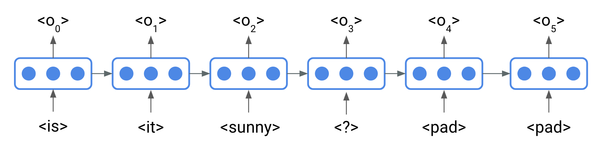

# Data
## Question / Annotation Data
This folder contains the subset of the VQA dataset. In total there are 60k Q/A pairs provided. Details about how the data was created can be found in the following [iPython Notebook](https://github.com/timbmg/NLP1-2017-VQA/blob/master/VQA%20Dataset%20Structure.ipynb). The data splits have the following sizes:
* Training Set: 48061
* Validation Set: 8977
* Test Set Size: 2962
## Question Data Structure
The Question data has the following structure:
```
- questions
  - image_id
  - question
  - question_id
  - split
```
## Annotation Data Structure
The Annotation data has the following structure:
```
- annotations
  - question_type
  - multiple_choice_answer
  - answers
    - answer
    - answer_confidence
    - answer_id
  - image_id
  - answer_type
  - question_id
  - split
```
When the VQA dataset was created, every Question has been asked to 10 different people. The answers and their confidence in the answer can be found in the `answers` of the annotation data. The answer to predict, is found under the `multiple_choice_answer` key. For further details you can also check out the [VQA paper](https://arxiv.org/pdf/1612.00837.pdf). The provided data (for both questions and annotations) has the same structure has the original dataset. 

## Image Features
The image features (ResNet) can be downloaded here: https://aashishv.stackstorage.com/s/MvvB4IQNk9QlydI

* VQA_image_features.h5 - contains the ResNet image features for all the images(train, val, test) as an array
* VQA_img_features2id.json - contains the mapping from image_id to index in the .h5 file

**WARNING**: Always convert the loaded data from .h5 file to numpy array. This is done because if you are using multiple threads to read the data from .h5 file sometimes it picks up data from the incorrect index.

### Example Code to access the image features

```python
import h5py
import json
import numpy as np

path_to_h5_file   = 'data/VQA_image_features.h5'
path_to_json_file = 'data/VQA_img_features2id.json'

# load image features from hdf5 file and convert it to numpy array
img_features = np.asarray(h5py.File(path_to_h5_file, 'r')['img_features'])

# load mapping file
with open(path_to_json_file, 'r') as f:
     visual_feat_mapping = json.load(f)['VQA_imgid2id']

# example how to access image features
img_id = 262145
h5_id = visual_feat_mapping[str(img_id)]
img_feat = img_features[h5_id]
```

### Get Images
While for training your models you can handle the image features as a black box, for testing and analysis you want to have a look at the actual image. The VQA dataset utilizes the 2014 version of [MSCOCO](http://cocodataset.org/). Many tasks like Image Captioning or Object Detection are using this dataset, so it might be worthwhile to download it. However, it is quite big (13GB train, 6GB validation, 6GB test). For this project you will only need the training dataset, since all datapoints are from this split. The image can be retrieved via the file name. The image id is equal the last digits of the image file name. 
Besides downloading the dataset, we are providing a second option. The MSCOCO annotations come with a flickr url where the images can be found online. The file `imgid2imginfo.json` contains the flickr url (and more image information) for the MSCOCO training and validation dataset. The file can be utilized as follows:

```python
import json

# load the image info file
with open('data/imgid2imginfo.json', 'r') as file:
    imgid2info = json.load(file)

print(imgid2info['265781'])
# RETURNS:
#{'coco_url': 'http://images.cocodataset.org/train2014/COCO_train2014_000000265781.jpg',
# 'date_captured': '2013-11-14 21:01:15',
# 'file_name': 'COCO_train2014_000000265781.jpg',
# 'flickr_url': 'http://farm6.staticflickr.com/5199/5882642496_9e58939526_z.jpg',
# 'height': 424,
# 'id': 265781,
# 'license': 1,
# 'width': 640}
``` 

### How to handle batch training, when Questions have different length?

The problem of handling different sequence lengths in your data, is a problem which you will encounter all the time in sequence modelling. In the VQA task, the questions have different lengths, meaning different number of words. When you use mini-batches to train your model, you need to take this into account. This is because the question in the mini-batch will have different lengths, therefore, the number of embeddings you will get for each question varies.
This problem is handled by artificially adding padding tokens to the question to make them all of the same length. For example:
```
is it sunny ? <pad> <pad> <pad> <pad> <pad> <pad>
how many dogs are there ? <pad> <pad> <pad> <pad>
what is the color of the ball ? <pad> <pad> 
```
The question lengths (= number of tokens per question) for these questions without the padding is 4, 6 and 8. After the pad tokens have been added all questions have the lenght 10.
To determine the length until you pad, you can do the following:
Look at the question length distribution of your data. What is the maximum length? What is the 90, 95, 99 percentile length? Usually, it makes sense not to pad until the maximum length, as this will add a lot of dimensions to your input, which are rarely used. Therefore, the lengths obtained from the percentiles, can be used. Questions which are actually longer than that can either be discraded from the training or only the first n tokens are used.
When you are using [nn.Embeddings](http://pytorch.org/docs/master/nn.html#torch.nn.Embedding) of PyTorch to train your embeddings (which is highly recommended!), you can actually specify a `padding_idx` parameter. This will assign an embedding of zeros to the padding token which will not get updated. In case of the Bag of Words, this little padding trick will handle the variable lengths of the questions!

#### Variable Length RNN
While for the Bag of Words adding a padding token will resolve issues with variable lengths input, for the RNN, an additional small logic needs to be implemented. Any Recurrent Neural Network produces an output vector o at every timestep t. In the following image this is illustrated with word embedding inputs.

As RNNs model sequences, their output will change (compared to the previous timestep) when the input is the padding token. In order to get the correct output (the output generated from the last _actual_ token, in this case o3 from <?>), we need to index to output vector.
This is easy, when you do not have a batch of outputs:
```python
outputs, _ = RNN(inputs) # outputs has dimensions [1, seq_len, hidden_size]
outputs = outputs[:, question_lengths-1] # minus to get from length to index
```
However, when using mini-batches, you need to use PyTorch's [gather](http://pytorch.org/docs/master/torch.html#torch.gather) function. This function will collect items in a matrix along a certain dimension. And that's exactly what we want to do along the batch dimension. Here's a minimal working example. We give a random input to the RNN and display the output. We see, that it contains the entire output vector, for both batch inputs. We set out question length to 2 and 3, therefore gather index 1 and 2.
```python 
import torch
from torch.autograd import Variable

rnn = torch.nn.LSTM(input_size=4, hidden_size=3, batch_first=True)
outputs, h_n = rnn(Variable(torch.rand(2, 3, 4))) # input is of shape [batch_size, sequence, features]
print(outputs)
# Variable containing:
# (0 ,.,.) = 
#  -0.0292 -0.0619  0.0684
#   0.0135 -0.0795  0.1152
#  -0.0301 -0.1259  0.0467
#
# (1 ,.,.) = 
#  -0.0389 -0.0502  0.0908
#  -0.0622 -0.0608  0.1352
#  -0.0360 -0.0932  0.0891
# [torch.FloatTensor of size 2x3x3]

question_lengths = Variable(torch.LongTensor([2,3]))

# Note that in the expanded size of the question_lengths, the sequence length dimension is 1. 
# This does the trick of getting only 1 particular output along the 1st (=sequence) dimension.
last_out = torch.gather(outputs, 1, question_lengths.view(-1,1,1).expand(2,1,3)-1) # minus 1 to get from length to index
print(last_out)

# Variable containing:
# (0 ,.,.) = 
#   0.0135 -0.0795  0.1152
# 
# (1 ,.,.) = 
#  -0.0360 -0.0932  0.0891
# [torch.FloatTensor of size 2x1x3]
```
